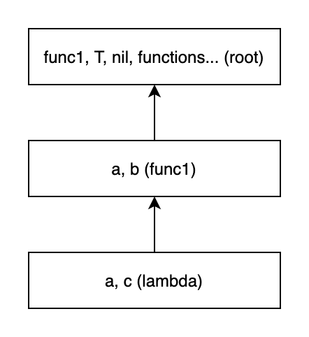

# LispXS

This is a minimalistic expandable realization of the Lisp family language. High performance isn't the purpose of this project.
It's reflection on how compact Lisp can be while still being fully expandable. A kind of clay from which you can sculpt anything. 

## Installation

build (go1.13.7):
```shell script
$ git clone https://github.com/batrSens/LispXS.git
$ cd ./LispXS
$ go build
```

tests running:
```shell script
$ cd {lispxs_directory}
$ go test ./...
```

run:
```shell script
$ cd {lispxs_directory}
$ ./LispXS [-n -e -r]
```

Flags set the mode that interpreter will work:
- `-n`: interpreter expects double newline at the end of program;
- `-e`: interpreter expects EOF at the end of program;
- `-r`: REPL mode (default).

## Usage as Golang library

- `Execute(program string) (*Output, error)` - returns result, output and error's output in Output struct.
- `ExecuteStdout(program string) (*ex.Expr, error)` - returns result. Using fmt.Stdout, fmt.Stdin and fmt.Stderr for i/o operations.
- `ExecuteTo(program string, ioout, ioerr io.Writer, ioin io.Reader) (*ex.Expr, error)` - returns result. For i/o operations used 
customs streams.
- `NewLibrary(path string) (*Library, error)` - loads a LispXS library to RAM for following using through `Call` method.
- `(lib *Library) Call(symbol string, args ...interface{}) (*ex.Expr, error)` - calls functions from the library. Arguments must be of
`string`, `int`, `float64` or `[]interface{}` types. Slice also must contain variables of enumerated types.

<details>
<summary>example (executable app)</summary>
<pre>
package main <br>
import (
    "fmt" <br>
    lispxs "github.com/batrSens/LispXS/interpreter"
) <br>
func main() {
    res, err := lispxs.Execute("(+ 'Hello, '| World!|)")
    if err != nil {
        panic(err)
    } <br>
    fmt.Println(res.Output.String) // Prints "Hello, World!"
}
</pre>
</details>

<details>
<summary>example (library)</summary>

LispXS library:
<pre>
(define hello (lambda (name)
  (+ '|Hello, | name '!)))<br>
(define ++ (lambda (a) (+ a 1)))
</pre>

Golang code:
<pre>
package main <br>
import (
	"fmt" <br>
	lispxs "github.com/batrSens/LispXS/interpreter"
) <br>
func main() {
    lib, err := lispxs.NewLibrary("path_to_file") // Loading library
    if err != nil {
        panic(err)
    }<br>
    res, err := lib.Call("hello", "World") // 'hello' call
    if err != nil {
        panic(err)
    }<br>
    fmt.Println(res.ToString()) // Prints "Hello, World!"<br>
    res, err = lib.Call("++", 2019) // '++' call
    if err != nil {
        panic(err)
    }<br>
    fmt.Println(res.ToString()) // Prints 2020
}
</pre>
</details>

## ~~Usage as FFI library~~

## How it works

### Types

- Number (e.g. `123`, `123.456`, `123456e-3`, `12.3456e1`, `-123`, `6/18`)
- Symbol (e.g. `sym`, `|sym|`, `|123|`, `|symbol with spaces|`. Following entries are equivalent: `{SYM}`, `|{SYM}|` 
(except numbers and whitespaces))
- Pair - non-empty list
- Nil - empty list

In logical expressions Nil is 'false', everything else - 'true' (not `nil` is `T` symbol).

### Expressions evaluating

Everything are expressions: program is expression, data is expression, result of expression calculating is expression.
Program is an expression that consists of expressions and returns result of last expression. Expressions are calculated as follows:
- if expression is symbol, it returns the expression that is assigned to it in the symbols table;
- if this is pair [e.g. `(+ (- 2 3) (+ 8 9))`], then calculates all (except for the [`quote`](#quote), [`define`](#define), 
[`set!`](#set!), [`lambda`](#lambda), [`defmacro`](#defmacro), [`if`](#if), [`or`](#or), [`and`](#and) and macros) elements 
of list [`(+ -1 17)`] then in case result of first element of the list is function or closure - it calculates with other elements 
of list as arguments [`16`], otherwise returns error;
- returns self otherwise.

### Scopes

By default, program works with root scope that contain all functions, `T` symbol with self and `nil` symbol with Nil (empty list).
New scopes can be created by closures calls. Parent scope determines at place of definition closure. This scopes exists while closure 
is calculates. When accessing a variable its value is searched at current scope then in parent scope etc. `define` func is used to 
define variable in current scope, `set!` - redefine exists variable in nearest scope that contain it.

E.g. `(define func1 (lambda (a b) (+ a ((lambda (a c) (/ a c b)) b a)))) (func1 5 3)` returns `5.2` because in inner scope available
`a`, `c` from 'lambda', `b` from 'func1' (`a` from inner 'lambda' shadows `a` from 'func1') and all from root scope:



### Prelude file

Before program will be executed interpreter finds 'prelude' file in current directory and evaluates its content. This file can contain
functions that will be used in program. Example is located in 'readme' directory of root of this repository.

<a name="errors"></a>
### Error handling

If an error occurs in the program (e.g. zero division: `(/ 9 0)`), then creates object 'Fatal' that falls to the bottom of call's 
stack and collects info about error location. When it process finished, 'Fatal' outputs to error's channel collected info. To catch 
'Fatal' object can be used operator 'catch'. Structure: `(catch body_that_can_throw_an_error (tag1 res) (tag2 res) ...)`. It catches 
an error and passed through the tags in turn. If suitable tag is found (tag is an prefix of error's tag or tag is equal to 'default'),
then calculates and returns its result. Otherwise, throws down the error.

Error also can be defined by user via function `throw`. Structure: `(throw 'tag res)`. If suitable tag of `catch` operator hasn't
'res', then it returns calculated 'res' value from `throw` function. If it is also missing, then returns nil.

Examples located at ['Function'](#throwcatch) section of readme.

## Expandability

Some examples of expandability are below (for more clarity of examples error handling is omitted and it is assumed 
that the input is correct).

<details>
<summary>list, apply</summary>

<table><tr><td>usage</td><td>result</td></tr>

<tr><td><pre>
(define list (lambda args args))
(defmacro apply s (define f (car s)) (define args1 (car (cdr s))) (list 'eval (list 'cons f args1)))
(apply - '(4 5 6))
</pre></td><td><pre>
-7
</pre></td></tr>

<tr><td><pre>
(define list (lambda args args))
(list 2 3 (+ 1 3))
</pre></td><td><pre>
(2 3 4)
</pre></td></tr>

</table>
</details>


<details>
<summary>libraries imports</summary>

<table><tr><td>usage</td><td>result</td><td>file</td></tr>

<tr><td><pre>
(define list (lambda args args))
(defmacro map (f1 args1)
  (define args1 (eval args1))
  (define helper (lambda (f args) (if args (cons (list f (car args)) (helper f (cdr args))) nil)))
  (cons 'list (helper f1 args1)))
(defmacro import (path)
    (list 'map 'eval (list 'load path)))
(import 'path_to_file)
(++ 7)
</pre></td><td><pre>
8
</pre></td><td><pre>
(define ++ (lambda (a) (+ a 1)))
(define -- (lambda (a) (- a 1)))
</pre></td></tr>

</table>
</details>

<details>
<summary>ban for func redefinition</summary>

<table><tr><td>usage</td><td>result</td></tr>

<tr><td><pre>
(define list (lambda args args))
((lambda ()
	(define temp set!)
	(defmacro settemp (sym val)
		(if (= sym '+) (throw '|couldn't redefine '+' func|))
		(list temp sym (eval val)))
	(set! set! settemp)))
(set! + >)
(+ 3 2)
</pre></td><td><pre>
ERROR
</pre></td></tr>

</table>
</details>

<details>
<summary>indexing of lists and mutability emulating</summary>

<table><tr><td>usage</td><td>result</td></tr>

<tr><td><pre>
(define list (lambda args args))
(define <= (lambda (a b) (or (< a b) (= a b)) ))
(define get (lambda (l n)
	(if (= n 0)
		(car l)
		(get (cdr l) (- n 1)))))
(defmacro setl! (l pos val)
	(define pos (eval pos))
	(define val (eval val))
	(define mut (lambda (l i v)
		(if (<= i 0) 
			(cons v (cdr l))
			(cons (car l) (mut (cdr l) (- i 1) v)))))
	(list 'set! l (list mut l pos (list 'quote val))))
	(define lst '(s trtrt 5 laa kooo r 4))
(setl! lst 3 'new)
(get lst 3)
</pre></td><td><pre>
new
</pre></td></tr>

</table>
</details>

<details>
<summary>definition of mutable structures definitions</summary>

<table><tr><td>usage</td><td>result</td></tr>

<tr><td><pre>
(define list (lambda args args))
(defmacro apply s (define f (car s)) (define args1 (car (cdr s))) (list 'eval (list 'cons f args1)))
(define list (lambda args args))
(define pow2 (lambda (x) (* x x)))
(define get (lambda (l n)
	(if (= n 0)
		(car l)
		(get (cdr l) (- n 1)))))
(define <= (lambda (a b) (or (< a b) (= a b)) ))
(define sqrt (lambda (x)
	(define findi (lambda (i)
		(if (<= (* i i) x)
			(findi (+ i 1))
			(- i 1))))
	(define i (findi 0))
	(define p (/ (- x (* i i)) (* 2 i)))
	(define a (+ i p))
	(- a (/ (* p p) (* 2 a)))))
(defmacro setl! (l pos val)
	(define mut (lambda (l i v)
		(if (<= i 0)
			(cons v (cdr l))
			(cons (car l) (mut (cdr l) (- i 1) v)))))
	(list 'set! l (list mut l pos (list 'quote val))))
(defmacro defstruct args
	(define structname (car args))
	(define funcname (lambda (str) (+ structname '- str)))
	(define methods (lambda (args i)
		(if (not args)
			nil
			(cons
				(list 'define (funcname (+ 'get- (car args))) (list 'lambda '(s) (list 'get 's i)))
				(cons
					(write (list 'defmacro (funcname (+ 'set- (car args))) '(s v) (list 'list ''setl! 's i 'v)))
					(methods (cdr args) (+ i 1)))))))
	(cons
		'begin
		(cons
			(list 'define (funcname 'new) (list 'lambda (cdr args) (cons 'list (cons (list 'quote structname) (cdr args)))))
			(cons
				(list 'define (funcname '?) (list 'lambda '(s) (list '= '(car s) (list 'quote structname))))
				(methods (cdr args) 1)))))
(defstruct point x y)
(define dist (lambda (p1 p2)
	(if (not (and (point-? p1) (point-? p2))) (throw '|points expected|))
	(sqrt (+ (pow2 (- (point-get-x p2) (point-get-x p1))) (pow2 (- (point-get-y p2) (point-get-y p1)))))))
(define pt1 (point-new 4 2))
(define pt2 (point-new -2 6))
(point-set-y pt1 -2)
(dist pt2 pt1)
</pre></td><td><pre>
10
</pre></td></tr>

</table>
</details>

## Functions

<a name="quote"></a>
### `quote`

Returns expression without calculation. Expects one argument. 
Following entries are equivalent: `(quote {EXPR})`, `'{EXPR}`.

<details>
<summary>examples</summary>

<table><tr><td>usage</td><td>result</td></tr>

<tr><td><pre>
(quote (one two))
</pre></td><td><pre>
(one two)
</pre></td></tr>

<tr><td><pre>
(quote 23)
</pre></td><td><pre>
23
</pre></td></tr>

</table>
</details>

---

### `eval`

Evaluates result of expression. Expects one argument.
Following entries are equivalent: `(eval (quote {EXPR}))`, `{EXPR}`.

<details>
<summary>examples</summary>

<table><tr><td>usage</td><td>result</td></tr>

<tr><td><pre>
(eval '(+ 23 32))
</pre></td><td><pre>
55
</pre></td></tr>

<tr><td><pre>
(eval 23)
</pre></td><td><pre>
23
</pre></td></tr>

</table>
</details>

---

<a name="define"></a>
### `define`

Defines variable in current scope. 
Expected two variables: first - symbol, second - an expression whose result will be saved and returned from `define`.

<details>
<summary>examples</summary>

<table><tr><td>usage</td><td>result</td></tr>

<tr><td><pre>
(define a 2)
</pre></td><td><pre>
2
</pre></td></tr>

<tr><td><pre>
(define a '|some string|)
</pre></td><td><pre>
some string
</pre></td></tr>

<tr><td><pre>
(define a (+ 20 3)) 
(+ a 32)
</pre></td><td><pre>
55
</pre></td></tr>

</table>
</details>

---

<a name="set!"></a>
### `set!`

Redefines existed variable in nearest scope. 
Expected two variables: first - symbol, second - an expression whose result will be saved and returned from `define`.

<details>
<summary>examples</summary>

<table><tr><td>usage</td><td>result</td></tr>

<tr><td><pre>
(define a 2) 
(set! a 3)
</pre></td><td><pre>
3
</pre></td></tr>

<tr><td><pre>
(define a 5) 
((lambda (b) (set! a (+ a b)) 50) 
a
</pre></td><td><pre>
55
</pre></td></tr>

</table>
</details>

---

<a name="lambda"></a>
### `lambda`

Returns new closure with current parent scope. When it closure will be called, a new scope is created.
Expected at least two variables: first - list with symbols that means arguments or symbol that means list of arguments,
second and subsequent - body of closure. Closure returns result of last expression of body.

<details>
<summary>examples</summary>

<table><tr><td>usage</td><td>result</td></tr>

<tr><td><pre>
(define a (lambda (b) (+ b b))) 
(a 3)
</pre></td><td><pre>
6
</pre></td></tr>

<tr><td><pre>
(define list (lambda args args))
(list 3 (+ 5 4) 0)
</pre></td><td><pre>
(3 9 0)
</pre></td></tr>

<tr><td><pre>
(define list (lambda args args))
(defmacro apply s (define f (car s)) (define args1 (car (cdr s))) (list 'eval (list 'cons f args1)))
(apply + '(1 2 3))
(define 100+ (lambda args
  (if args
    (cons
      (+ 100 (car args))
      (apply 100+ (cdr args)))
    nil)))
(100+ 1 4 7)
</pre></td><td><pre>
(101 104 107)
</pre></td></tr>

<tr><td><pre>
(define a 5) 
((lambda (b) (set! a (+ a b)) 50) 
a
</pre></td><td><pre>
55
</pre></td></tr>

</table>
</details>

---

<a name="defmacro"></a>
### `defmacro`

Defines macro in current scope. When it macro will be called, new code will be created and then executed.
Expected at least three variables: first - symbol, second - list with symbols that means arguments or 
symbol that means list of arguments (if the symbol is preceded by a comma then expression calculates),
third and subsequent - body of macro. Macro executes result of last expression of body.

<details>
<summary>examples</summary>

<table><tr><td>usage</td><td>result</td></tr>

<tr><td><pre>
(define list (lambda args args))
(define a 2) 
(defmacro set10! (b) (list 'set! b 10))
(set10! a)
a
</pre></td><td><pre>
10
</pre></td></tr>

<tr><td><pre>
(defmacro apply s (define f (car s)) (define args1 (car (cdr s))) (list 'eval (list 'cons f args1)))
(apply + '(3 4 5))
</pre></td><td><pre>
12
</pre></td></tr>

<tr><td><pre>
(define list (lambda args args))
(defmacro map (f1 ,args1)
  (define helper (lambda (f args)
    (if args
      (cons (list f (car args)) (helper f (cdr args)))
      nil)))
  (cons list (helper f1 args1)))
(map - '(1 2 3))
</pre></td><td><pre>
(-1 -2 -3)
</pre></td></tr>

</table>
</details>

---

<a name="if"></a>
### `if`

Conditional operator. Expected two or three arguments: first - conditional, second - expression that will be calculated
and whose result will be returned from `if` in case of result of conditional is not `nil`, third - else. If the third argument 
is missing - `if` returns `nil` in case result of conditional is `nil`.

<details>
<summary>examples</summary>

<table><tr><td>usage</td><td>result</td></tr>

<tr><td><pre>
(if (> 2 3) 'two 'three)
</pre></td><td><pre>
three
</pre></td></tr>

<tr><td><pre>
(if (> 2 1) 'two)
</pre></td><td><pre>
two
</pre></td></tr>

<tr><td><pre>
(if (> 2 3) 'two)
</pre></td><td><pre>
nil
</pre></td></tr>

</table>
</details>

---

<a name="or"></a>
### `or`

Calculates expressions until it meats not `nil` value. Returns this value. If all results of expressions are `nil` then returns `nil`.
Returns `nil` in case of zero number of arguments.

<details>
<summary>examples</summary>

<table><tr><td>usage</td><td>result</td></tr>

<tr><td><pre>
(or 2 3)
</pre></td><td><pre>
2
</pre></td></tr>

<tr><td><pre>
(define a 3)
(or nil (define a 5) (define a 10))
a
</pre></td><td><pre>
5
</pre></td></tr>

<tr><td><pre>
(or (cdr '(2)) nil)
</pre></td><td><pre>
nil
</pre></td></tr>

<tr><td><pre>
(or)
</pre></td><td><pre>
nil
</pre></td></tr>

</table>
</details>

---

<a name="and"></a>
### `and`

Calculates expressions until it meats `nil` value. If one of results of expressions is `nil` then returns `nil`. Result of last
expression otherwise. Returns `T` in case of zero number of arguments.

<details>
<summary>examples</summary>

<table><tr><td>usage</td><td>result</td></tr>

<tr><td><pre>
(and 2 3)
</pre></td><td><pre>
3
</pre></td></tr>

<tr><td><pre>
(define a 3)
(and nil (define a 5) (define a 10))
a
</pre></td><td><pre>
3
</pre></td></tr>

<tr><td><pre>
(and (cdr '(3 3)) 'YY)
</pre></td><td><pre>
YY
</pre></td></tr>

<tr><td><pre>
(and)
</pre></td><td><pre>
T
</pre></td></tr>

</table>
</details>

---

<a name="throwcatch"></a>
### `catch`

Catches an error. For more information, see an [error handling](#errors) section.

<details>
<summary>examples</summary>

<table><tr><td>usage</td><td>result</td></tr>

<tr><td><pre>
(catch (/ 2 0) (/ 123123))
</pre></td><td><pre>
123123
</pre></td></tr>

</table>
</details>

---

### `throw`

Throws an error. For more information, see an [error handling](#errors) section.

<details>
<summary>examples</summary>

<table><tr><td>usage</td><td>result</td></tr>

<tr><td><pre>
(catch (throw 'error) (err 123123))
</pre></td><td><pre>
123123
</pre></td></tr>

</table>
</details>

---

### `write`

Writes string representation of expression's result to output channel. Returns it result. Expected one argument.

<details>
<summary>examples</summary>

<table><tr><td>usage</td><td>result</td><td>out</td></tr>

<tr><td><pre>
(write '(2))
</pre></td><td><pre>
(2)
</pre></td><td><pre>
(2)
</pre></td></tr>

<tr><td><pre>
(write (if T 'ss 3))
</pre></td><td><pre>
ss
</pre></td><td><pre>
ss
</pre></td></tr>

</table>
</details>

---

### `read`

Reads string representation of expressions from output channel and returns list of these expressions. 
Expected zero number of arguments.

<details>
<summary>examples</summary>

<table><tr><td>usage</td><td>result</td><td>in</td></tr>

<tr><td><pre>
(read)
</pre></td><td><pre>
((2) 3)
</pre></td><td><pre>
(2) 3
</pre></td></tr>

</table>
</details>

---

### `load`

Reads string representation of expressions from file and returns list of these expressions. Expected one argument - path to file.

<details>
<summary>examples</summary>

<table><tr><td>usage</td><td>result</td><td>file</td></tr>

<tr><td><pre>
(load 'path_to_file)
</pre></td><td><pre>
(45 (+ 6 7))
</pre></td><td><pre>
45
(+ 6 7)
</pre></td></tr>

</table>
</details>

---

### `begin`

Returns result of last expression (`nil` in case of zero number of arguments).

<details>
<summary>examples</summary>

<table><tr><td>usage</td><td>result</td></tr>

<tr><td><pre>
(begin)
</pre></td><td><pre>
nil
</pre></td></tr>

<tr><td><pre>
(begin 4 (+ 4 5) 'qwerqwe (/ 3 (- 1 2)))
</pre></td><td><pre>
-3
</pre></td></tr>

</table>
</details>

---

### `cons`

Returns new pair. Expected two arguments: first will be 'car' of new pair, second - 'cdr'. Second argument must be a pair or `nil`.

<details>
<summary>examples</summary>

<table><tr><td>usage</td><td>result</td></tr>

<tr><td><pre>
(cons 2 nil)
</pre></td><td><pre>
(2)
</pre></td></tr>

<tr><td><pre>
(cons (+ 5 6) '(12 13 14))
</pre></td><td><pre>
(11 12 13 14)
</pre></td></tr>

</table>
</details>

---

### `car`

Returns 'car' of pair. Expected one argument that must be a pair.

<details>
<summary>examples</summary>

<table><tr><td>usage</td><td>result</td></tr>

<tr><td><pre>
(car '(2))
</pre></td><td><pre>
2
</pre></td></tr>

<tr><td><pre>
(car '((4 5) 6 7))
</pre></td><td><pre>
(4 5)
</pre></td></tr>

</table>
</details>

---

### `cdr`

Returns 'cdr' of pair. Expected one argument that must be a pair.

<details>
<summary>examples</summary>

<table><tr><td>usage</td><td>result</td></tr>

<tr><td><pre>
(cdr '(2))
</pre></td><td><pre>
nil
</pre></td></tr>

<tr><td><pre>
(cdr '((4 5) 6 7))
</pre></td><td><pre>
(6 7)
</pre></td></tr>

</table>
</details>

---

### `symbol->number`

Converts symbol to number. Expected one argument that must be a symbol that name equal to string representation of any number.

<details>
<summary>examples</summary>

<table><tr><td>usage</td><td>result</td></tr>

<tr><td><pre>
(symbol->number '|  23 |)
</pre></td><td><pre>
23
</pre></td></tr>

<tr><td><pre>
(symbol->number '|6/3|)
</pre></td><td><pre>
2
</pre></td></tr>

<tr><td><pre>
(symbol->number '|1234.56e-2|)
</pre></td><td><pre>
12.3456
</pre></td></tr>

<tr><td><pre>
(symbol->number '|  -23.4|)
</pre></td><td><pre>
-23.4
</pre></td></tr>

</table>
</details>

---

### `number->symbol`

Converts number to symbol with name that equal to string representation of number. Expected one argument that must be a number.

<details>
<summary>examples</summary>

<table><tr><td>usage</td><td>result</td></tr>

<tr><td><pre>
(define |234| (lambda (a) (+ a 1)))
((eval (number->symbol 234)) 5)
</pre></td><td><pre>
6
</pre></td></tr>

</table>
</details>

---

### `symbol?`

Returns `T` if argument is a symbol and `nil` otherwise. Expected one argument.

<details>
<summary>examples</summary>

<table><tr><td>usage</td><td>result</td></tr>

<tr><td><pre>
(symbol? '|2|)
</pre></td><td><pre>
T
</pre></td></tr>

<tr><td><pre>
(symbol? 2)
</pre></td><td><pre>
nil
</pre></td></tr>

</table>
</details>

---

### `number?`

Returns `T` if argument is a number and `nil` otherwise. Expected one argument.

<details>
<summary>examples</summary>

<table><tr><td>usage</td><td>result</td></tr>

<tr><td><pre>
(number? 2)
</pre></td><td><pre>
T
</pre></td></tr>

<tr><td><pre>
(number? '|2|)
</pre></td><td><pre>
nil
</pre></td></tr>

</table>
</details>

---

### `pair?`

Returns `T` if argument is a pair and `nil` otherwise. Expected one argument.

<details>
<summary>examples</summary>

<table><tr><td>usage</td><td>result</td></tr>

<tr><td><pre>
(pair? '(2 3 4 5))
</pre></td><td><pre>
T
</pre></td></tr>

<tr><td><pre>
(pair? nil)
</pre></td><td><pre>
nil
</pre></td></tr>

</table>
</details>

---

### `not`

Returns `T` if argument is `nil` and `nil` otherwise. Expected one argument.

<details>
<summary>examples</summary>

<table><tr><td>usage</td><td>result</td></tr>

<tr><td><pre>
(not nil)
</pre></td><td><pre>
T
</pre></td></tr>

<tr><td><pre>
(not 1234)
</pre></td><td><pre>
nil
</pre></td></tr>

</table>
</details>

---

### `=`

Returns `T` if argument are equivalent and `nil` otherwise. Expected at least two arguments.

<details>
<summary>examples</summary>

<table><tr><td>usage</td><td>result</td></tr>

<tr><td><pre>
(= 's2 (begin 's2) (if nil 2 's2) (+ 's '|2|))
</pre></td><td><pre>
T
</pre></td></tr>

<tr><td><pre>
(= '(2 3) (cons 2 '(3)))
</pre></td><td><pre>
T
</pre></td></tr>

<tr><td><pre>
(= 2 '|2|)
</pre></td><td><pre>
nil
</pre></td></tr>

<tr><td><pre>
(= 2 2 2 2 2 3)
</pre></td><td><pre>
nil
</pre></td></tr>

</table>
</details>

---

### `>`

Returns `T` if first argument more than second and `nil` otherwise. Expected two numbers.

<details>
<summary>examples</summary>

<table><tr><td>usage</td><td>result</td></tr>

<tr><td><pre>
(> 3 2)
</pre></td><td><pre>
T
</pre></td></tr>

<tr><td><pre>
(> 3 3)
</pre></td><td><pre>
nil
</pre></td></tr>

</table>
</details>

---

### `<`

Returns `T` if first argument less than second and `nil` otherwise. Expected two numbers.

<details>
<summary>examples</summary>

<table><tr><td>usage</td><td>result</td></tr>

<tr><td><pre>
(< -7 2)
</pre></td><td><pre>
T
</pre></td></tr>

<tr><td><pre>
(< 4 2)
</pre></td><td><pre>
nil
</pre></td></tr>

</table>
</details>

---

### `len`

Returns length `T` of symbol's name in characters. Expected one symbol.

<details>
<summary>examples</summary>

<table><tr><td>usage</td><td>result</td></tr>

<tr><td><pre>
(len '12345)
</pre></td><td><pre>
5
</pre></td></tr>

<tr><td><pre>
(len '漢字!)
</pre></td><td><pre>
3
</pre></td></tr>

</table>
</details>

---

### `+`

Returns sum of numbers or symbol that name is concatenation of names all symbols in arguments. 
Expected any quantity of numbers or at least one symbol.

<details>
<summary>examples</summary>

<table><tr><td>usage</td><td>result</td></tr>

<tr><td><pre>
(+ 2 3 4)
</pre></td><td><pre>
9
</pre></td></tr>

<tr><td><pre>
(+ 'hello, '| world!|)
</pre></td><td><pre>
hello, world!
</pre></td></tr>

<tr><td><pre>
(+)
</pre></td><td><pre>
0
</pre></td></tr>

</table>
</details>

---

### `-`

Returns difference of numbers or symbol that name is substring of symbol's name ( [second_arg, third_arg) ). 
Expected any quantity of numbers or least one symbol and two numbers.

<details>
<summary>examples</summary>

<table><tr><td>usage</td><td>result</td></tr>

<tr><td><pre>
(- 2)
</pre></td><td><pre>
-2
</pre></td></tr>

<tr><td><pre>
(- 2 3 4)
</pre></td><td><pre>
-5
</pre></td></tr>

<tr><td><pre>
(- 'thisstringishuge 4 10)
</pre></td><td><pre>
string
</pre></td></tr>

<tr><td><pre>
(-)
</pre></td><td><pre>
0
</pre></td></tr>

</table>
</details>

---

### `*`

Returns product of numbers. Expected any quantity of numbers.

<details>
<summary>examples</summary>

<table><tr><td>usage</td><td>result</td></tr>

<tr><td><pre>
(* 2 3)
</pre></td><td><pre>
6
</pre></td></tr>

<tr><td><pre>
(*)
</pre></td><td><pre>
1
</pre></td></tr>

</table>
</details>

---

### `/`

Returns division of numbers. Expected at least one number.

<details>
<summary>examples</summary>

<table><tr><td>usage</td><td>result</td></tr>

<tr><td><pre>
(/ 6 2 4)
</pre></td><td><pre>
0.75
</pre></td></tr>

<tr><td><pre>
(/ 7)
</pre></td><td><pre>
7
</pre></td></tr>

</table>
</details>
